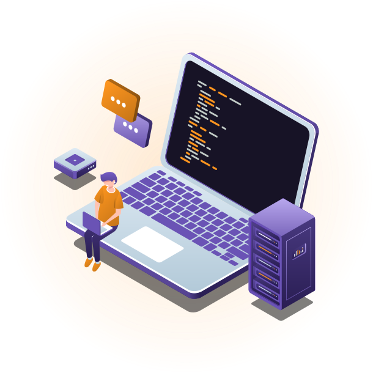
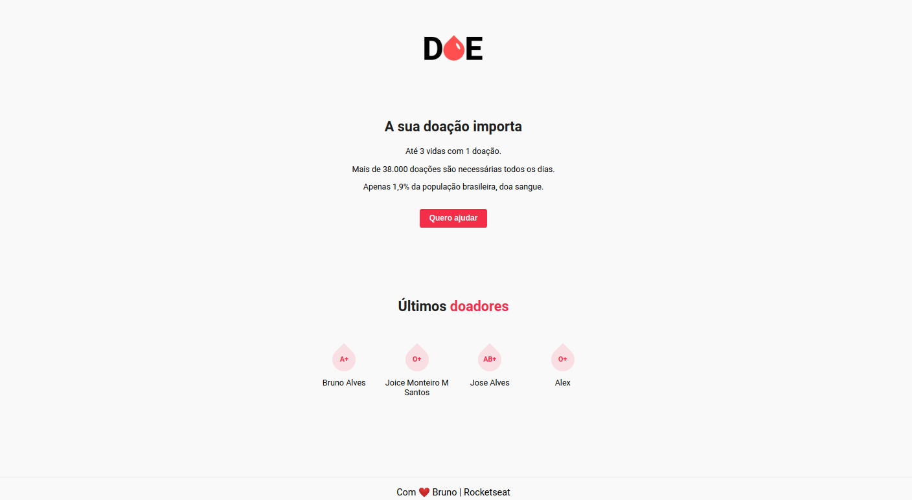

  

<h1 align="center">Maratona Dev 3</h1>

Projeto <strong>Doe Sangue</strong> Desenvolvido durante a 3ª Edição da MaratonaDev da Rocketseat

<a aria-label="Versão do Node" href="https://github.com/nodejs/node/blob/master/doc/changelogs/CHANGELOG_V12.md#12.14.1">
    </img>
</a>

   </a>
    <a aria-label="Completo" href="https://rocketseat.com.br/maratonadev/aulas/3.0?aula=2">
    </img>
  </a>
  
  <a aria-label="Repo Size" href="README.md">
  	</img>
  </a>

## :rocket: Tecnologias, ferramentas e dependências

### Esse projeto foi desenvolvido com as seguintes tecnologias:

[Node.js](https://nodejs.org/en/)
| [Javascript](https://developer.mozilla.org/pt-BR/docs/Aprender/JavaScript)
| [Html](https://tableless.com.br/o-que-html-basico/)
| [CSS](https://www.w3schools.com/css/)
| [Nodemon](https://nodemon.io/)
| [PostgreSQL](https://www.postgresql.org/)
| [Nunjucks](https://mozilla.github.io/nunjucks/)

## :syringe: Projeto

#### O Doe Sangue é um projeto para incentivar, encontrar e registrar doadores de sangue, desenvolvido nos dias 17 e 18 de Fevereiro de 2020 na MaratonaDev da Rocketseat, cadastre-se como um doador de sangue!

## :computer: Tela

</img>

## :round_pushpin: Instalando o Projeto

1 - <strong>git clone https://github.com/vespidhook/DOE.git</strong> | para baixar o repositório  
2 - <strong>npm install </strong> | para instalar as dependencias 
3 - <strong>npm start</strong> | para iniciar o projeto na porta 3000 

## :memo: Licença

#### Esse projeto está sob a licença [MIT](./LICENSE) &copy; [Rocketseat](https://rocketseat.com.br/)
